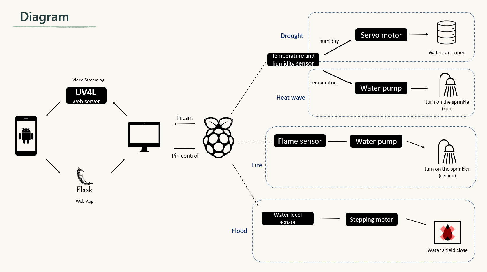

# GAEKSEORI
기후변화에 적응한 돼지축사

Girls in ICT 2023 Hackathon

We have created an automated pigisty that can adapt to various climate changes.In addition, it is possible to watch live streaming and control the sensor in the pigsty using a web app.
It was made to adapt to heat wave, fire, flood, and drought.

Main function
1. Open the water tank using the servo motor after detecting rain(drought).
2. Turn on the water pump on the roof after detecting the temperature(heat wave).
3. When a flood is detected, use a stepping motor to close the water shield(flood).
4. If a fire is detected, turn on the water pump on the ceiling(fire).
5. Live streaming from web app.
6. Control of water shield and water pump in web apps(for emergency).

There are many sensors, so the files are divided into three sections(fire and heatwave.py,servo and humidity.py,step motor and water level.py), and the final.py is the complete version.
The file related to the web app is placed separately from the sensor action file

- Embedded System : Raspberry pi 4
- IDE: Vscode 
- hardware: Pi Camera Module/ JT-180A DC 6V 12V (Water pump) / Servo motor /  Stepping motor & driver / DFT11(Temperature and humidity sensor)/ Relay module/ Flame detection sensor/ Water level sensor/ PCF8591 
- software: Python (3.9.2) / FLASK/ UV4L
